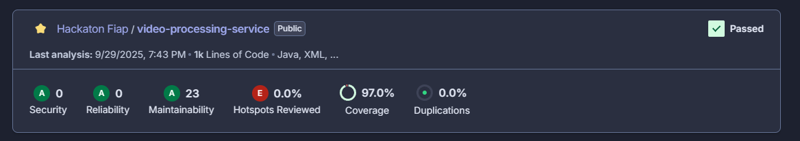
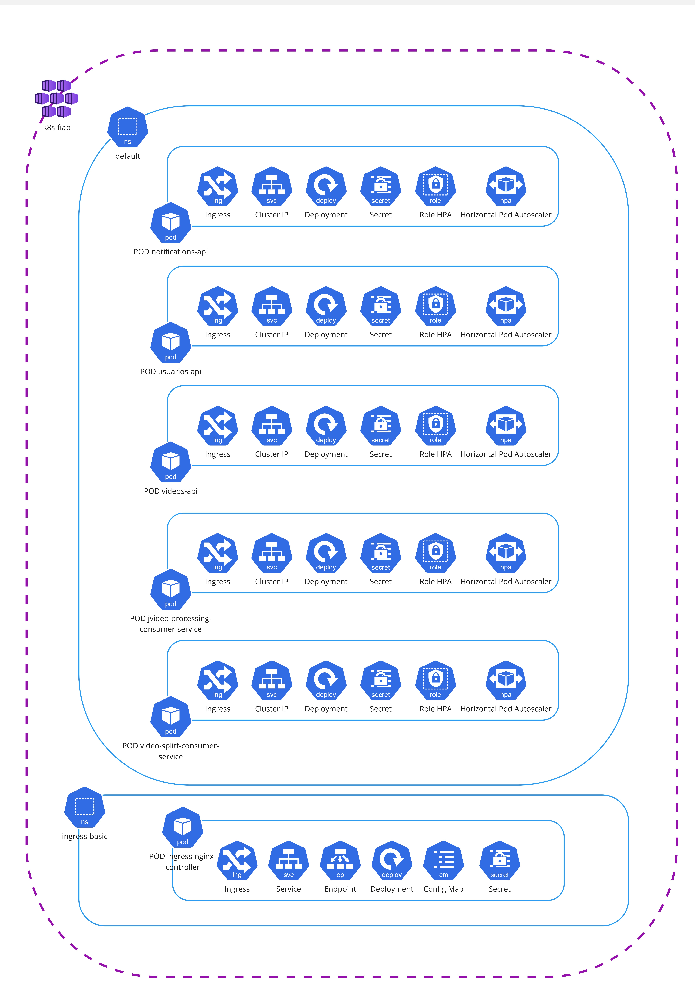

# Hackaton - Video Processing Consumer Service

Serviço Quarkus para processamento de vídeos a partir de eventos Kafka: baixa chunks do Azure Blob Storage, extrai frames em PNG, controla progresso no Redis, gera um ZIP com os frames ao final e publica status no Kafka.

## Funcionalidades

- **Consumo Kafka**: Consome mensagens com metadados do vídeo/chunk no canal `video-split`.
- **Download de Chunk**: Busca o chunk no Azure Blob Storage.
- **Extração de Frames**: Extrai frames com JCodec, amostrando a cada N frames (configurável).
- **Persistência de Frames**: Salva frames `.png` no Azure Blob por usuário/vídeo.
- **Controle de Progresso**: Usa Redis para acompanhar chunks processados e orquestrar o zip final.
- **Geração de ZIP**: Ao completar todos os chunks, cria `frames.zip` com todos os frames e limpa blobs intermediários.
- **Publicação de Status**: Emite eventos de sucesso/erro em tópico Kafka configurável.
- **Health Check**: SmallRye Health exposto via Quarkus.

## Formatos de Vídeo Suportados

- Compatíveis com JCodec (recomendado: MP4/H.264).

## Stack Tecnológico

- **Java 21**
- **Quarkus 3.25.4**
- **SmallRye Reactive Messaging (Kafka)**
- **Azure Blob Storage SDK**
- **Redis (Quarkus Redis Client)**
- **JCodec/JCodec-JavaSE**
- **ModelMapper**
- **Maven**, **Docker & Docker Compose**
- **JUnit 5**, Mockito, **JaCoCo**

## Arquitetura


Considerando Clean Architecture:
- As camadas `presentation`/`infrastructure` equivalem a Framework & Drivers (consumer Kafka, adapters Azure/Kafka/Redis).
- A camada `application` contém orquestração/casos de uso/mapeadores.
- A camada `domain` representa as entidades.

## Estruturação das pastas

```
src/main/java/br/com/video/processing/
├── presentation/
│   └── kafka/
│       ├── VideoProcessingConsumer.java
│       └── impl/VideoProcessingConsumerImpl.java
├── application/
│   ├── controller/ (VideoProcessingController, Impl)
│   ├── usecase/ (GetVideoUseCase, ExtractFramesUseCase, CompleteChunkUseCase, PublishVideoStatusUseCase, impl/)
│   └── mapper/ (RequestVideoInfoMapper, impl/)
├── infrastructure/
│   ├── kafka/ (VideoStatusProducer, impl/KafkaVideoStatusProducer)
│   ├── azure/storage/adapter/ (AzureBlobGenericPersister, AzureBlobVideoStorageFetcher, AzureFramesZipperService)
│   └── redis/ (RedisChunkProgressRepository)
├── common/
│   ├── domain/dto/event/ (VideoStatusEvent)
│   ├── domain/dto/request/ (UploadedVideoInfoDto)
│   └── interfaces/ (BlobStoragePersister, VideoStorageFetcher, ChunkProgressRepository, FramesZipper)
└── domain/
    └── VideoChunkInfo
```

## 🚀 Início Rápido

### Pré-requisitos

- Docker e Docker Compose
- Java 21
- Maven 3.8+

### Variáveis de ambiente / Secrets (Local vs Kubernetes)

Este projeto usa variáveis relacionadas a Kafka (Event Hubs), Redis e parâmetros internos:

- `KAFKA_BOOTSTRAP_SERVERS` (default `kafka:9092`)
- `KAFKA_SECURITY_PROTOCOL` (default `SASL_SSL`)
- `KAFKA_SASL_MECHANISM` (default `PLAIN`)
- `KAFKA_SASL_JAAS_CONFIG` (sensível)
- `KAFKA_AUTO_OFFSET_RESET` (default `latest`)
- `KAFKA_CONSUMER_GROUP` (default `video-processing`)
- `VIDEO_SPLITTED_TOPIC` (default `video.split`)
- `VIDEO_STATUS_TOPIC` (default `video.status`)
- `VIDEO_FRAMES_SAMPLE_EVERY_N_FRAMES` (default `30`)
- `REDIS_HOSTS` (default `redis://localhost:6379` ou `redis://redis:6379` no Compose)
- `REDIS_USERNAME`, `REDIS_PASSWORD` (opcionais)
- `REDIS_CHUNK_TTL_SECONDS` (default `600`)

No Kubernetes usamos `kubernetes/Secret.yaml` (chaves em `stringData`). No ambiente local (Docker Compose) usamos um arquivo `.env`.

### Limitação importante

O Docker Compose NÃO lê diretamente um `Secret.yaml` do Kubernetes. Converta para `.env` ou declare manualmente em `docker-compose.yml`.

### Scripts auxiliares

1. `scripts/env-from-secret.ps1`
   - Converte `kubernetes/Secret.yaml` (stringData) em um arquivo `.env`.
   - Uso:
     ```powershell
     powershell -ExecutionPolicy Bypass -File scripts/env-from-secret.ps1 -SecretPath kubernetes/Secret.yaml -OutFile .env
     ```

2. `scripts/secret-from-env.ps1`
   - Gera `kubernetes/Secret.yaml` a partir de um `.env` (fonte de verdade local).
   - Uso:
     ```powershell
     powershell -ExecutionPolicy Bypass -File scripts/secret-from-env.ps1 -EnvPath .env -SecretPath kubernetes/Secret.yaml
     ```

### Executando com Docker Compose

O arquivo `docker-compose.yml` já referencia:

```yaml
env_file:
  - .env
```

Passos:

```bash
# 1. Gerar/atualizar .env (editar manualmente ou via script)
# 2. Build do app (gera target/quarkus-app)
mvn -DskipTests package
# 3. Subir o stack
docker compose up -d --build
# 4. Logs
docker compose logs -f app
```

## 🔧 Configuração Quarkus

- HTTP root path: `quarkus.http.root-path=/video-processing`
- Health: `GET /video-processing/q/health`
- Config dos canais Kafka em `src/main/resources/application.properties`:
  - Incoming: `video-split` → tópico `${VIDEO_SPLITTED_TOPIC}`
  - Outgoing: `video-events` → tópico `${VIDEO_STATUS_TOPIC}`

## 🔄 Fluxo de Processamento

1. Consumer `video-split` recebe `UploadedVideoInfoDto` com:
   - `videoId`, `userId` (UUID), `containerName`, `connectionString`, `fileName`, `chunkPosition`, `totalChunks`.
2. `GetVideoUseCase` busca o blob do chunk:
   - Path esperado: `"{videoId}/chunks/{fileName}"`.
3. `ExtractFramesUseCaseImpl` extrai frames e salva PNG no Azure:
   - Path: `"{userId}/{videoId}/part_{chunkPosition}_frame_{index}.png"`.
4. `CompleteChunkUseCaseImpl` atualiza progresso no Redis e, se completou todos os chunks:
   - `AzureFramesZipperService.zipFrames()` gera `frames.zip` e remove blobs intermediários.
5. `KafkaVideoStatusProducer` publica evento no tópico `${VIDEO_STATUS_TOPIC}`:
   - `SUCCESS` ao finalizar zip; `ERROR` em caso de falha.

## 📨 Exemplos de Mensagens Kafka

### Incoming (video-split) → `UploadedVideoInfoDto`

Tópico: `${VIDEO_SPLITTED_TOPIC}` (default `video.split`)

Key (opcional): `videoId` como string

Payload (JSON):

```json
{
  "videoId": 12345,
  "userId": "550e8400-e29b-41d4-a716-446655440000",
  "containerName": "videos-container",
  "connectionString": "DefaultEndpointsProtocol=https;AccountName=...;AccountKey=...;EndpointSuffix=core.windows.net",
  "fileName": "chunk_0001.mp4",
  "chunkPosition": 1,
  "totalChunks": 10
}
```

Exemplo com `kafka-console-producer`:

```bash
# sem headers
kafka-console-producer \
  --bootstrap-server localhost:9092 \
  --topic video.split <<'EOF'
{"videoId":12345,"userId":"550e8400-e29b-41d4-a716-446655440000","containerName":"videos-container","connectionString":"<conn>","fileName":"chunk_0001.mp4","chunkPosition":1,"totalChunks":10}
EOF
```

### Outgoing (video-events) → `VideoStatusEvent`

Tópico: `${VIDEO_STATUS_TOPIC}` (default `video.status`)

Key (definida): `videoId` como string

Payload (JSON):

```json
{
  "userId": "550e8400-e29b-41d4-a716-446655440000",
  "videoId": 12345,
  "status": "SUCCESS"
}
```

Exemplo de consumo com `kafka-console-consumer`:

```bash
kafka-console-consumer \
  --bootstrap-server localhost:9092 \
  --topic video.status \
  --from-beginning \
  --property print.key=true \
  --property key.separator="," \
  --timeout-ms 30000
```

## 🐳 Serviços Docker

O ambiente de desenvolvimento inclui:

- **Kafka 3.6 (Bitnami)**
- **Redis 7.0**
- **App Quarkus** (monta `./target/quarkus-app`)

Arquivo: `docker-compose.yml`

## 🧪 Testes

```bash
mvn test
```

Relatórios de cobertura com JaCoCo.

## 📚 Documentação

- **Config Quarkus**: `src/main/resources/application.properties`
- **Health Checks**: `GET /video-processing/q/health`
- **Mensageria**:
  - Incoming: canal `video-split` → tópico `${VIDEO_SPLITTED_TOPIC}`
  - Outgoing: canal `video-events` → tópico `${VIDEO_STATUS_TOPIC}`

## Cobertura Sonar


## Arquitetura Infraestrutura

### Diagrama de Fluxo

- Dentro do Resource Group techchallenge-rg, há um IP Público que acessa o APIM (Azure API Management)
- Quando acessado e havendo configuração de suas políticas realiza a chamada para a function.
- O Ingress Controller então roteia as requisições para os diferentes serviços internos a depender da URI chamada, utilizando a comunicação via Cluster IP.
- As aplicações java se comunicam com seus respectivos databases utilizando a comunicação via Cluster IP.
  Obs: Para saber mais sobre o recurso Standard_B2S: https://learn.microsoft.com/pt-br/azure/virtual-machines/sizes/general-purpose/bv1-series?tabs=sizebasic

### Diagrama de Componente

O cluster k8s-fiap é configurado com dois namespaces principais, cada um com funções específicas:
- default: Namespace onde as aplicações principais são implantadas e gerenciadas, contendo os PODs:
    - java-app-*: microsserviço presente no cluster.
        - Ingress: Configurado para gerenciar o tráfego de entrada direcionado à aplicação Java.
        - Cluster IP: Endereço IP interno para comunicação dentro do cluster.
        - Deployment: Gerencia a implantação e a escalabilidade da aplicação Java.
        - Secret: Armazena dados sensíveis, como chaves de API ou credenciais usadas pela aplicação.
        - Horizontal Pod Autoscaler (HPA): Configurado para escalar automaticamente o número de réplicas do pod com base na utilização de CPU.
        - Configuração do HPA:
            - Mínimo de 1 e máximo de 3 réplicas.
            - Escala a partir da métrica de uso de CPU atingir 70%.
        - Role HPA: Define as permissões necessárias para que o HPA acesse métricas do cluster (como CPU e memória) para tomar decisões de escalabilidade.
- ingress-basic: é responsável por gerenciar o tráfego externo e rotear as requisições para os serviços no namespace default.
    - ingress-nginx-controller: Executa o controlador NGINX Ingress, que atua como ponto de entrada para requisições externas e roteia o tráfego para os serviços apropriados no namespace default.
        - Ingress: Define as regras de roteamento para requisições externas (por exemplo, rotear requisições para o serviço do java-app).
        - Service: Expõe o controlador NGINX internamente no cluster.
        - Endpoint: Mapeia os endpoints para os serviços internos.
        - Deployment: Gerencia a implantação do controlador NGINX.
        - ConfigMap: Armazena configurações do NGINX, como limites de requisições, timeouts e outras opções de personalização.
        - Secret: Armazena informações sensíveis, como certificados TLS para habilitar HTTPS.    
          *Os arquivos de configuração do Kubernetes (em formato .yml) estão organizados no diretório `kubernetes/`.
